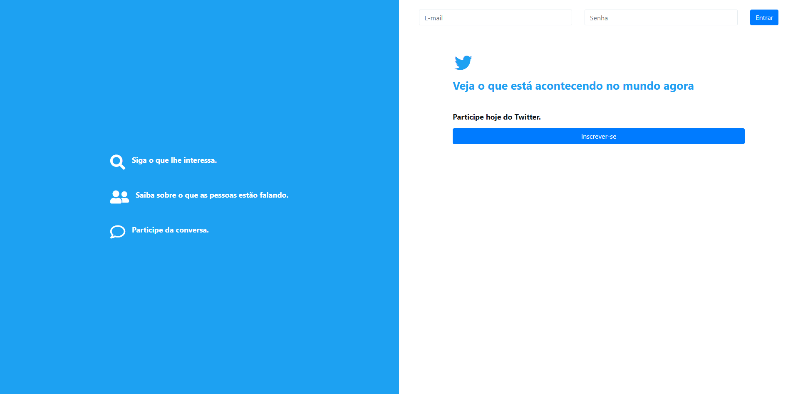

  <h1>Projeto Twitter Clone</h1> 
  
  
Projeto desenvolvido com o curso "Desenvolvimento Web completo" da Udemy, aprimoraro habilidades em desenvolvimento full-stack

---

## Sobre o Projeto

Este projeto é um clone do site Twitter(pré-X) onde podemos fazer nosso cadastro, criar novos tweets, seguir pessoas e mais... Foi criado com o objetivo de praticar e demonstrar conhecimentos em tecnologias full-stack, com foco em fixar conceitos de MVC.

---

## Tecnologias Utilizadas

- **HTML5** – estrutura da página
- **CSS3** – estilização personalizada
- **Bootstrap** – framework para responsividade e componentes
- **MVC** – arquitetura utilizada
- **PHP** – estrutura back-end com PDO.
- **MYSQL** – sistema de banco de dados.

---

## Preview

